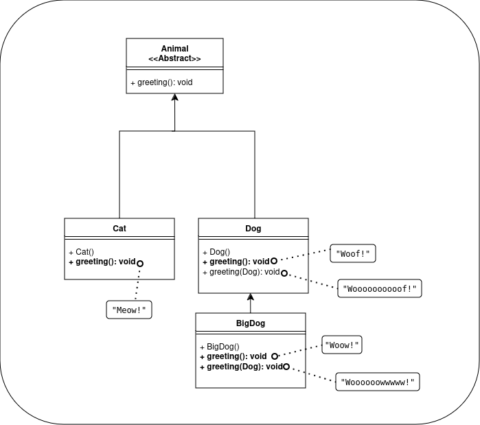

# EXERCICIOS LINGUAGEM DE PROGRAMAÇÃO II
****
Nesta tarefa foram resolvidos os exercícios:
- 4.1 - Implementar as classes Circle e Cylinder usando Herança (lembrar que nós implementados em aula a classe círculo no exercício 1.1, disponível no repositório da disciplina).


- 5.2 - Reimplementar as classes do exercício 4.1 desta vez usando Composição e responda a pergunta final: Qual design de projeto é melhor? Herança ou composição? Justifique a sua resposta.

**Resposta:** <span style="color:red"> Tanto Composição quanto Herança têm suas utilidades, e depende da necessidade. No caso do Cilindro que contém um círculo como base, ter a composição faz mais sentido teórico, mas ambos os casos casam bem na modelagem.</span>

- 6.6 - Implementar a superclasse abstrata Animal e suas subclasses


- 6.7 - Criar os diagramas UML a partir do código apresentado no exercício.


**disponíveis no [link](https://www3.ntu.edu.sg/home/ehchua/programming/java/j3f_oopexercises.html)**

## Questóes de escrever
### Perguntas adicionais que podem cair na prova (entregar a resposta num arquivo texto incluído no arquivo compactado com os exercícios acima resolvidos):

1. Qual a diferença entre polimorfismo em tempo de execução e polimorfismo em tempo de compilação? Por que um é chamado de estático e o outro de dinâmico? Dê exemplos de cada tipo (diferentes dos que usamos em aula).

2. Explique com suas palavras a diferença entre herança, composição e agregação. Crie um exemplo de cada em Java e inclua numa pasta separada assim como fez com os exercícios da lista.

## Pré-requisitos
Antes de começar, certifique-se de que você tem o .NET 8.0 instalado. Você pode verificar isso executando:

```
dotnet --version
```

Se você não tiver o .NET instalado, siga as instruções abaixo de acordo com sua distribuição.

### Arch Linux
1. **Instale o .NET SDK:**
   ```
   sudo pacman -S dotnet-sdk
   ```
### Debian
1. **Instale o .NET SDK:**

   ```
   sudo apt-get install -y dotnet-sdk-8.0
   ```

### Fedora

1. **Instale o .NET SDK:**

   ```
   sudo dnf install dotnet-sdk-8.0
   ```

## Clonando a Solução
Clone o repositório da solução usando o Git:

```
git clone https://github.com/PauloFH/LP2_Exercicies2.git
cd LP2_Exercicies2
```

## Estrutura da Solução

A solução contém três projetos:

- **The_Circle_and_Cylinder_Classes**
- **The_CCC_Using_Composition**
- **Animal_Abstract**
- **Abstract_Superclass_Animal**
- **HCA**

Antes de executar a solução, você precisa restaurar as dependências:

```
dotnet restore
```

## Compilando a Solução

Compile a solução para garantir que tudo está funcionando corretamente:

```
dotnet build
```

## Executando os Projetos
Para executar um dos projetos, navegue até o diretório do projeto e execute:
#### 4.1  Ex: The_Circle_and_Cylinder_Classes
```
cd The_Circle_and_Cylinder_Classes
dotnet run
```
Resultado:
```
Cylinder: radius=1 height=1 base area=3,14 volume=3,14
Cylinder: subclass of Circle[Radius=1,00,Color=red], height = 1

Cylinder: radius=10 height=1 base area=314,16 volume=314,16
Cylinder: subclass of Circle[Radius=10,00,Color=red], height = 1

Cylinder: radius=2 height=10 base area=12,57 volume=125,66
Cylinder: subclass of Circle[Radius=2,00,Color=red], height = 10
```
#### 5.2  Ex: The_CCC_Using_Composition
```
cd ..
cd The_CCC_Using_Composition
dotnet run
```
Resultado:
```
Cylinder: radius=1 height=1 base area=3,14 volume=3,14
Cylinder: base=(radius=1, color=red), height = 1

Cylinder: radius=10 height=1 base area=314,16 volume=314,16
Cylinder: base=(radius=10, color=red), height = 1

Cylinder: radius=2 height=10 base area=12,57 volume=125,66
Cylinder: base=(radius=2, color=red), height = 10
```
Tanto Composição quanto Herança tem suas utlidades, e depende da necessidade. no caso do Cilindro que contem um circulo como base, ter a composição faz mais sentido teórico, mas ambos casos casam bem na modelagem.
#### 6.6  Ex: Animal_Abstract
```
cd ..
cd Animal_Abstract
dotnet run
```

Resultado:

```
Cat:[ Batman ]
Meow
Dog:[ Kratos ]
Woof
Dog:[ Rex ]
Woooof
Big Dog:[ Princess ]
Wooow
Woooooow
Big Dog:[ Cutie ]
Wooooooooow
```

****

#### 6.7  Ex: Another View of Abstract Superclass Animal and its Implementation Subclasses

```
cd ..
cd Animal_Abstract
dotnet run
```
Classe teste:
```
Cat cat1 = new Cat();
cat1.greeting();
Dog dog1 = new Dog();
dog1.greeting();
BigDog bigDog1 = new BigDog();
bigDog1.greeting();
// Using Polymorphism
Animal animal1 = new Cat();
animal1.greeting();
Animal animal2 = new Dog();
animal2.greeting();
Animal animal3 = new BigDog();
animal3.greeting();
// Animal animal4 = new Animal();
// ERRO AO INSTANCIAR ANIMAL DIRETAMENTE POR SER ABSTRATA

// Downcast
Dog dog2 = (Dog)animal2;
BigDog bigDog2 = (BigDog)animal3;
Dog dog3 = (Dog)animal3;
//Cat cat2 = (Cat)animal2; 
// ERRO AO CONVERTER ANIMAL2 QUE É CACHORRO EM GATO
dog2.greeting(dog3);
dog3.greeting(dog2);
dog2.greeting(bigDog2);
bigDog2.greeting(dog2);
bigDog2.greeting(bigDog1);
```
Saída: 
```
Meow!
Woof!
Woow!
Meow!
Woof!
Woow!
Woooooooooof!
Woooooowwwww!
Woooooooooof!
Woooooowwwww!
Woooooowwwww!
```
### Diagrama:




****
### Perguntas adicionais que podem cair na prova:

1. Qual a diferença entre polimorfismo em tempo de execução e polimorfismo em tempo de compilação? Por que um é chamado de estático e o outro de dinâmico? Dê exemplos de cada tipo (diferentes dos que usamos em aula).
   - **Resposta:** 
   O polimorfismo em tempo de de execução é quando durante a execução do programa ocorre a decisão de qual método será executado e ocorre em metódos sobrescritos marcados como override, e virtual, uma vez que o runtime saberá que aquele método é sobrescrito.
     
   Nesse exemplo a classe curso é abstrata e tem o método IniciarCurso() que são métodos sobrescritos dependendo da classe filha e será decidido em tempo de execução qual método será executado apartir da assinatura da classe.

         public abstract class Curso {
             public string Nome { get; set; }
             public int DuracaoHoras { get; set; }
             public abstract void IniciarCurso();
         }
         public class CursoPresencial : Curso {
             public string Local { get; set; }
             public override void IniciarCurso() {
                 Console.WriteLine($"Iniciando o curso presencial {Nome} no local {Local}.");
             }
         }
         public class CursoOnline : Curso {
             public string Plataforma { get; set; }
             public override void IniciarCurso() {
                 Console.WriteLine($"Iniciando o curso online {Nome} na plataforma {Plataforma}.");
             }
         }
   Já o polimorfismo em tempo de compilação é quando os métodos ganham uma assinatura diferente no compilador.
      Nesse exemplo a sobrecarga, na qual dois métodos com os mesmo nome, mas que recebe tipos de dado de entrada diferente, são considerados dois métodos diferentes para o compilador.
      ``` 
      public class Estudante {
      public string Nome { get; set; }
       public void Matricular(CursoPresencial curso){
           Console.WriteLine($"{Nome} matriculado no curso {CursoPresencial.Nome}.");
       }
       public void Matricular(CursoOnline curso) {
           Console.WriteLine($"{Nome} matriculado no curso {CursoOnline.Nome}.");
           curso.IniciarCurso();
       }
      }
      ```
2. Explique com suas palavras a diferença entre herança, composição e agregação. Crie um exemplo de cada em Java e inclua numa pasta separada assim como fez com os exercícios da lista.
   - **Resposta:** 
     - Heraça é quando uma classe herda as propiedades e comportamentos da classe base, e podendo adicionar novos, usado para uma especialização da classe base.
     - Composição é quando uma classe contem uma outra classe como propiedade. Ou seja, o objeto contido depende do objeto que contem ele. deve ser usado quando o objeto tem que garantir a existencia dele para funcionamento.
     - Agregação é quando um objeto contem outro, mas não há uma dependêncis direta. Ou seja, os objetos agregados podem existir sem serem do objeto que agrega.
      
   Exemplos:
   
   ```
   cd ..
   cd HCA
   dotnet run
   ```
      
   Resultado:
      
   ```
   Herança:
   Employee[position=worker, name=gustas, encrypted password=-1408148375]
   login success
   
   Composição:
   Notebook[Brand=Dell, Processor=Intel i7]
   
   Agregação:
   Employees in TI Department:
   Employee[position=Dev front, name=Alice, encrypted password=-1389727064]
   Employee[position=Dev Back, name=Bob, encrypted password=-1184917314]
   ```
      
   ****
